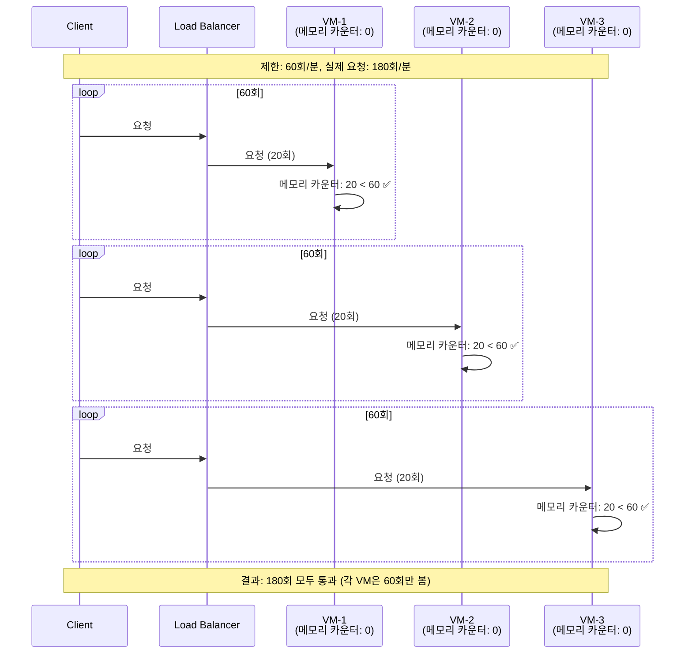

# Autoscaling 환경에서 Rate Limiting 문제

## 문제 상황

현재 메모리 기반 Rate limiting (`storage_uri="memory://"`)은 **VM autoscaling 시 제대로 작동하지 않습니다**.

### 문제 시나리오

```
제한: IP당 60회/분

인스턴스 1 (VM-1):
  - IP A가 40회 요청 → 통과 (40 < 60) ✅
  
인스턴스 2 (VM-2):
  - IP A가 40회 요청 → 통과 (40 < 60) ✅

실제 결과:
  - IP A는 총 80회 요청했지만 각 인스턴스는 40회만 봐서 통과됨 ❌
  - 제한이 2배로 느슨해짐 (실제로는 120회/분 허용)
```

### Autoscaling 시 문제



## 해결 방법: Redis 기반 Rate Limiting

모든 인스턴스가 **공유 Redis**를 사용하여 카운터를 공유합니다.

### Redis 기반 동작

```mermaid
sequenceDiagram
    participant Client
    participant LB as Load Balancer
    participant VM1 as VM-1
    participant VM2 as VM-2
    participant VM3 as VM-3
    participant Redis[(Redis<br/>공유 카운터)]

    Note over Client,Redis: 제한: 60회/분, 실제 요청: 180회/분

    loop 60회
        Client->>LB: 요청
        LB->>VM1: 요청
        VM1->>Redis: INCR key (카운터: 1, 2, ..., 60)
        Redis-->>VM1: 카운터 값
        alt 카운터 <= 60
            VM1-->>Client: 200 OK ✅
        else 카운터 > 60
            VM1-->>Client: 429 Too Many Requests ❌
        end
    end

    loop 60회
        Client->>LB: 요청
        LB->>VM2: 요청
        VM2->>Redis: INCR key (카운터: 61, 62, ..., 120)
        Redis-->>VM2: 카운터 값
        alt 카운터 <= 60
            VM2-->>Client: 200 OK ✅
        else 카운터 > 60
            VM2-->>Client: 429 Too Many Requests ❌
        end
    end

    loop 60회
        Client->>LB: 요청
        LB->>VM3: 요청
        VM3->>Redis: INCR key (카운터: 121, 122, ..., 180)
        Redis-->>VM3: 카운터 값
        alt 카운터 <= 60
            VM3-->>Client: 200 OK ✅
        else 카운터 > 60
            VM3-->>Client: 429 Too Many Requests ❌
        end
    end

    Note over Client,Redis: 결과: 60회 통과, 120회 차단 (정확한 제한)
```

## 구현 방법

### 1. Redis 설정 추가

`app/config.py`에 Redis 설정 추가:

```python
# Redis (Rate Limiting용)
redis_host: str = Field(
    default="localhost",
    description="Redis 호스트 (Rate limiting 공유 저장소)"
)
redis_port: int = Field(
    default=6379,
    description="Redis 포트"
)
redis_password: str = Field(
    default="",
    description="Redis 비밀번호 (비우면 인증 없음)"
)
redis_db: int = Field(
    default=0,
    description="Redis DB 번호"
)
redis_ssl: bool = Field(
    default=False,
    description="Redis SSL 사용 여부"
)
```

### 2. Rate Limiting 미들웨어 수정

`app/middlewares/rate_limit_middleware.py` 수정:

```python
# Redis 기반 storage URI 생성
def get_storage_uri() -> str:
    """Redis 또는 메모리 기반 storage URI 반환."""
    if settings.redis_host and settings.redis_host != "localhost":
        # Redis 사용
        password_part = f":{settings.redis_password}@" if settings.redis_password else ""
        ssl_part = "rediss://" if settings.redis_ssl else "redis://"
        return f"{ssl_part}{password_part}{settings.redis_host}:{settings.redis_port}/{settings.redis_db}"
    else:
        # 개발 환경: 메모리 사용
        return "memory://"

limiter = Limiter(
    key_func=get_remote_address,
    default_limits=[f"{settings.rate_limit_per_minute}/minute"] if settings.rate_limit_enabled else [],
    storage_uri=get_storage_uri(),  # Redis 또는 메모리
)
```

### 3. 환경 변수 설정

```bash
# Redis 설정
REDIS_HOST=redis.example.com
REDIS_PORT=6379
REDIS_PASSWORD=your-redis-password
REDIS_DB=0
REDIS_SSL=false
```

## 성능 고려사항

### Redis 연결 풀링

slowapi는 내부적으로 Redis 연결을 관리하지만, 성능을 위해 연결 풀링을 고려할 수 있습니다.

### Redis 장애 대응

Redis가 다운되면 Rate limiting이 실패할 수 있습니다. 두 가지 옵션:

1. **Fail Open**: Redis 실패 시 Rate limiting 비활성화 (서비스 가용성 우선)
2. **Fail Closed**: Redis 실패 시 모든 요청 차단 (보안 우선)

권장: **Fail Open** (서비스 가용성 우선, 모니터링으로 Redis 상태 추적)

```python
def get_storage_uri() -> str:
    """Redis 또는 메모리 기반 storage URI 반환."""
    try:
        if settings.redis_host and settings.redis_host != "localhost":
            # Redis 사용
            password_part = f":{settings.redis_password}@" if settings.redis_password else ""
            ssl_part = "rediss://" if settings.redis_ssl else "redis://"
            return f"{ssl_part}{password_part}{settings.redis_host}:{settings.redis_port}/{settings.redis_db}"
        else:
            # 개발 환경: 메모리 사용
            return "memory://"
    except Exception as e:
        logger.warning(f"Redis 설정 실패, 메모리 모드로 fallback: {e}")
        return "memory://"  # Fallback to memory
```

## 모니터링

Redis 기반 Rate limiting 사용 시 다음을 모니터링해야 합니다:

1. **Redis 연결 상태**: Redis 다운 시 감지
2. **Redis 지연시간**: Rate limiting 체크 성능
3. **Rate limit 차단률**: 정상적인 제한 작동 확인

## 결론

- ✅ **현재 문제**: 메모리 기반은 autoscaling 시 부정확
- ✅ **해결책**: Redis 기반으로 전환
- ✅ **구현**: 설정 추가 및 미들웨어 수정
- ✅ **모니터링**: Redis 상태 및 성능 추적

**즉시 조치 필요**: 프로덕션 환경에서 autoscaling 사용 시 Redis 기반으로 전환 필수
