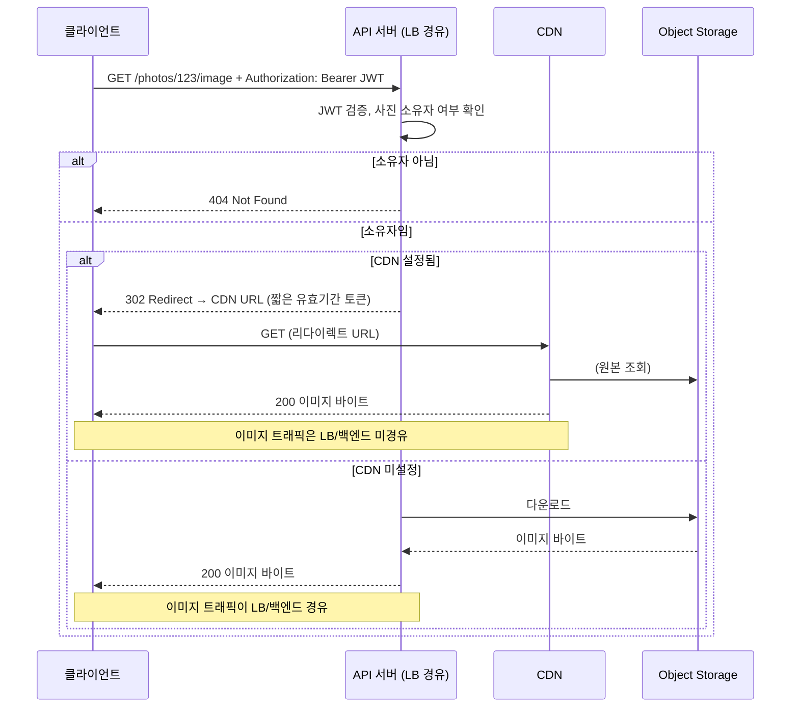
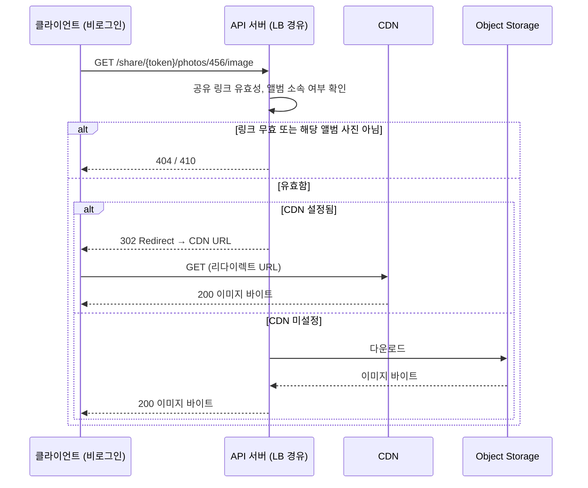
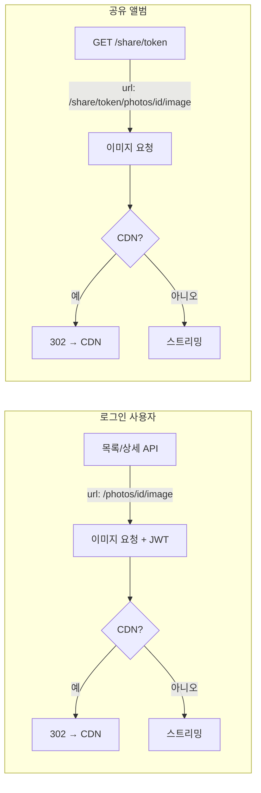

# 이미지 접근: 안전하고 효율적인 방식

이미지 URL은 **인가**를 보장하고, 트래픽은 **로드밸런서/백엔드를 최소화**하도록 구성되어 있습니다.

## 동작 요약

| 구분 | 설명 |
|------|------|
| **API가 반환하는 URL** | `/photos/{photo_id}/image` (쿼리 토큰 없음, URL 유출 시에도 의미 없음) |
| **인가** | 이미지 요청 시 **JWT 필수**. 해당 사진의 **소유자**만 접근 가능. |
| **효율** | CDN 설정 시 서버가 **302 리다이렉트** → 브라우저가 CDN에서 직접 다운로드 (이미지 바이트가 LB/백엔드 경유 안 함). |
| **공유 앨범** | 인증 없이 접근: `/share/{token}/photos/{photo_id}/image` (공유 링크 유효 시 해당 앨범 사진만). |

## 흐름도

### 로그인 사용자: 내 사진 이미지 접근



### 공유 앨범: 비로그인 이미지 접근



### URL·트래픽 요약



## 로그인 사용자 (내 사진/앨범)

1. 목록/상세 API(`GET /photos`, `GET /photos/{id}` 등)는 **JWT 필요**.
2. 응답의 `url`은 항상 **`/photos/{photo_id}/image`**.
3. 이미지를 보려면 **같은 JWT를 넣어서** 이 경로로 요청:

   ```http
   GET /photos/123/image
   Authorization: Bearer <JWT>
   ```
4. 서버는 권한 확인 후:
   - **CDN 설정됨** → `302 Redirect` → 브라우저가 CDN URL로 이동해 이미지 다운로드 (트래픽은 CDN 경유).
   - **CDN 미설정** → 이미지 바이트를 그대로 스트리밍 (LB/백엔드 경유).

### 클라이언트 예시 (웹)

``는 기본적으로 `Authorization` 헤더를 보내지 않으므로, 다음 중 하나가 필요합니다.

**방법 1: fetch + Blob URL (권장)**

```javascript
async function loadPhotoImage(photoId, jwtToken) {
  const res = await fetch(`/photos/${photoId}/image`, {
    headers: { Authorization: `Bearer ${jwtToken}` },
  });
  if (!res.ok) throw new Error('Failed to load image');
  const blob = await res.blob();
  return URL.createObjectURL(blob);
}

// 사용
const url = await loadPhotoImage(123, accessToken);
imgElement.src = url;
```

**방법 2: 같은 오리진 + 쿠키 인증**

백엔드에서 쿠키 기반 세션을 사용하고, `/photos/{id}/image`가 쿠키로 인증을 받도록 구성한 경우에는 ``만으로도 동작할 수 있습니다. (현재 API는 Bearer JWT 기준입니다.)

## 공유 앨범 (비로그인)

1. `GET /share/{token}` 으로 공유 앨범 조회 (인증 불필요).
2. 응답의 각 사진 `url`은 **`/share/{token}/photos/{photo_id}/image`**.
3. 이미지 요청 시 **JWT 없이** 해당 URL로 요청:

   ```http
   GET /share/abc123.../photos/456/image
   ```
4. 서버는 공유 링크 유효성·앨범 소속만 검사한 뒤, 동일하게 CDN 302 또는 스트리밍.

공유 앨범은 `` 로 그대로 사용 가능합니다.

## 설정

- **CDN** (`NHN_CDN_DOMAIN`, `NHN_CDN_APP_KEY` 등): 설정 시 이미지 요청은 302로 CDN 경유.
- **image_token_expire_seconds**: 리다이렉트용 CDN URL 토큰 유효 시간(초, 기본 120).

## 정리

- **안전**: API 응답에는 만료 토큰이 포함된 URL이 없고, 이미지 접근은 JWT(또는 공유 시 공유 토큰)로만 가능.
- **효율**: CDN 사용 시 이미지 바이트는 CDN → 클라이언트로만 전달되고, 로드밸런서/백엔드는 리다이렉트 한 번만 처리합니다.
