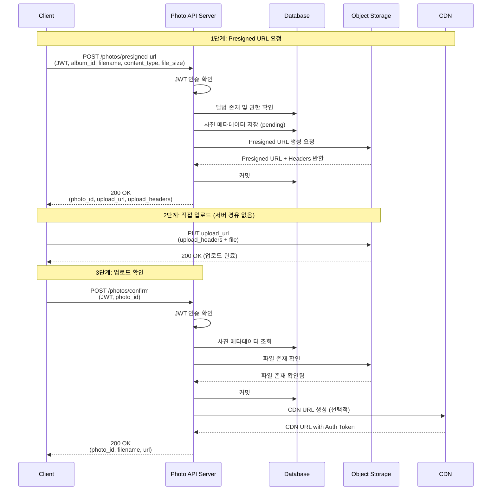
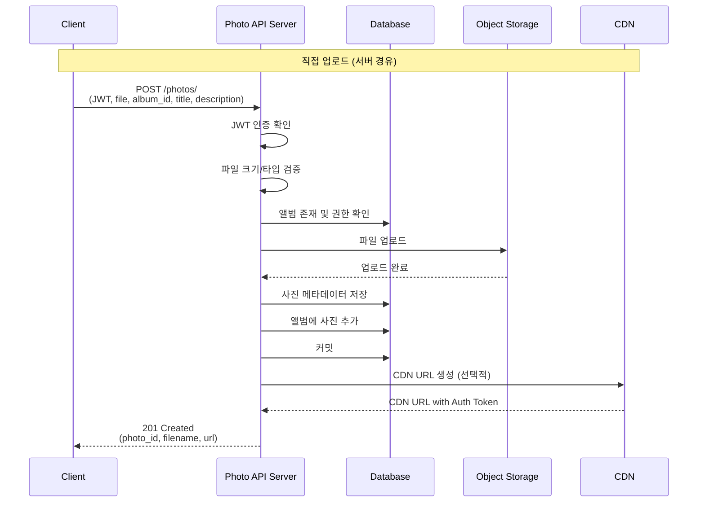
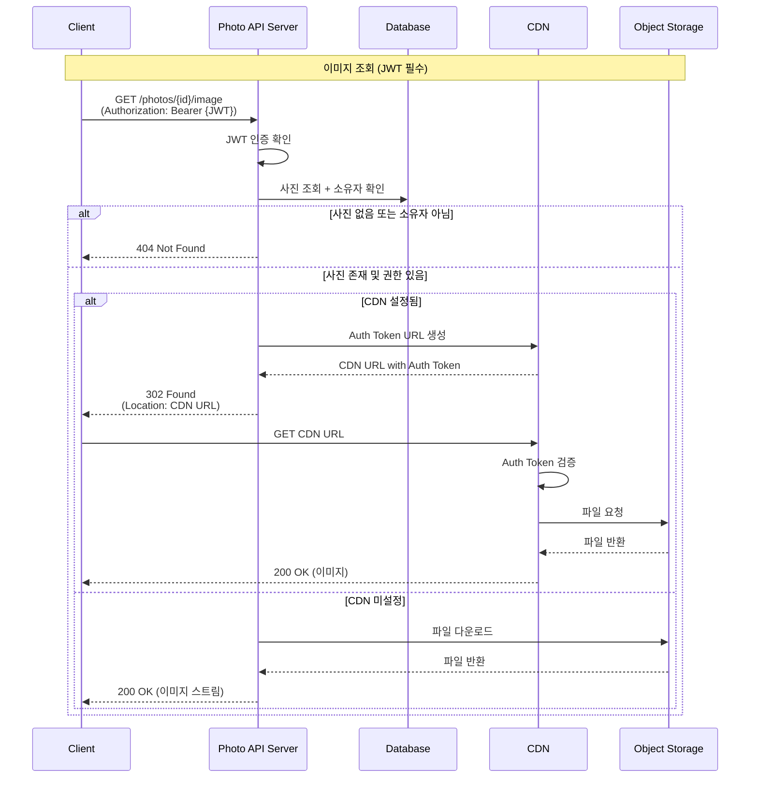
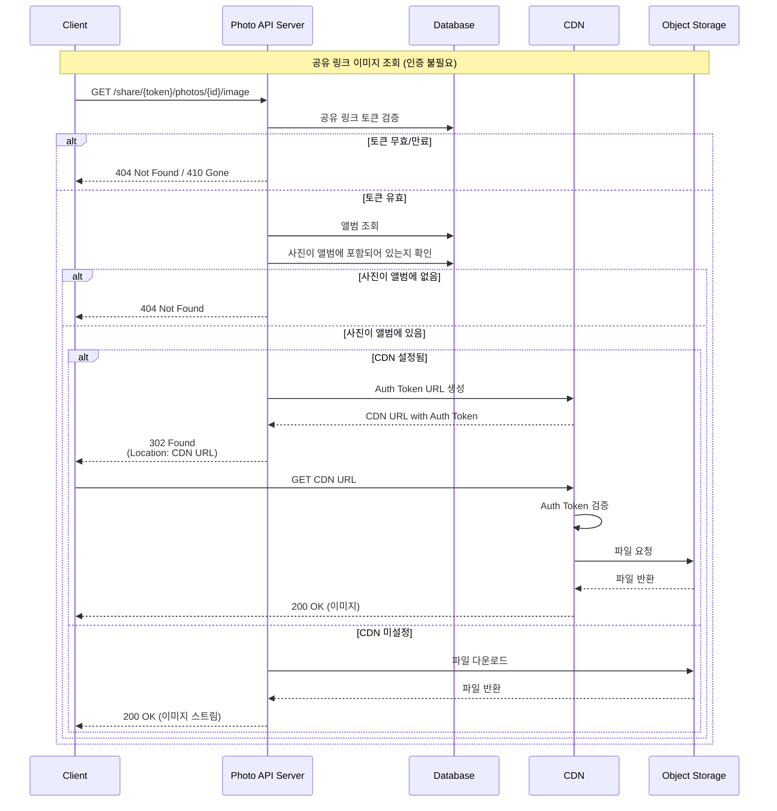
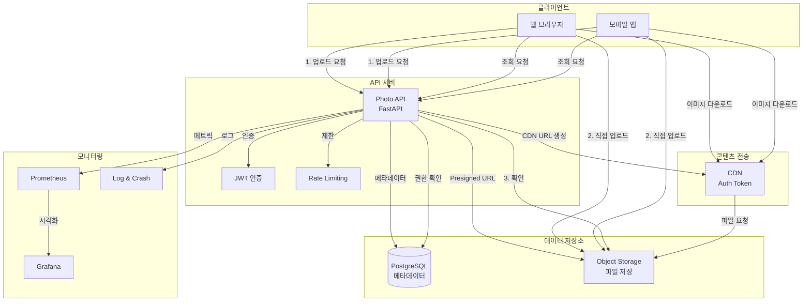
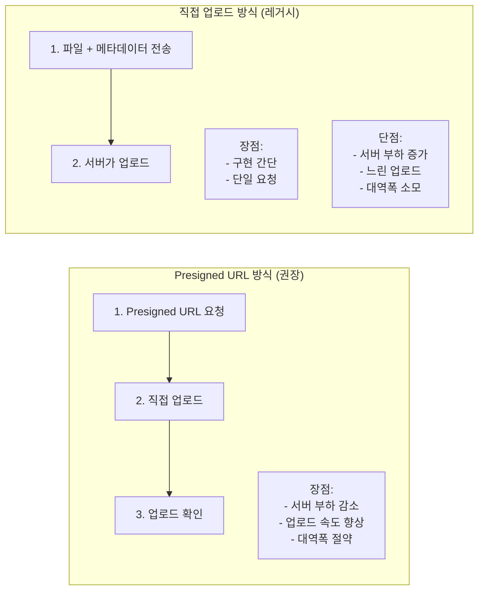
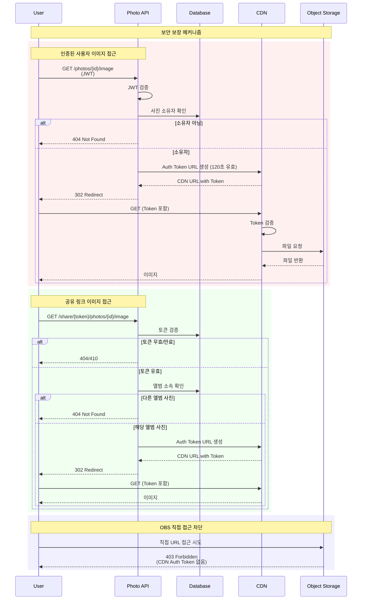
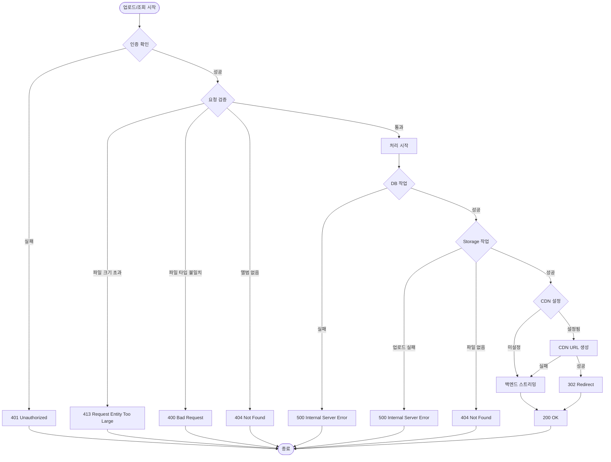
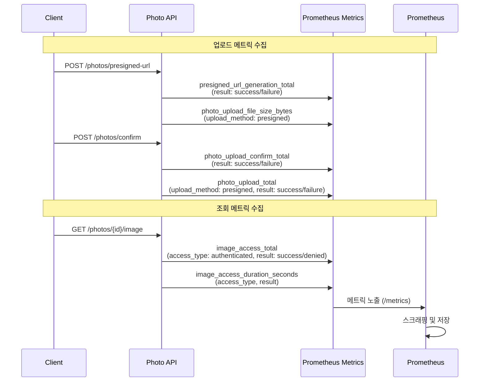

# 이미지 업로드 및 조회 흐름 다이어그램

## 1. Presigned URL 방식 업로드 (권장)

## 2. 직접 업로드 방식 (레거시)

## 3. 인증된 사용자 이미지 조회

## 4. 공유 링크를 통한 이미지 조회

## 5. 전체 이미지 업로드 및 조회 아키텍처

## 6. 업로드 방식 비교

## 7. 보안 흐름

## 8. 에러 처리 흐름

## 9. 메트릭 수집 포인트

## 10. 성능 최적화 포인트

```mermaid
graph TB
    subgraph "업로드 최적화"
        P1[Presigned URL 사용]
        P2[직접 업로드]
        P3[서버 부하 감소]
        P1 --> P2 --> P3
    end

    subgraph "조회 최적화"
        C1[CDN 리다이렉트]
        C2[Auth Token 캐싱]
        C3[로드밸런서 우회]
        C1 --> C2 --> C3
    end

    subgraph "데이터베이스 최적화"
        D1[인덱스 활용]
        D2[비동기 쿼리]
        D3[연결 풀링]
        D1 --> D2 --> D3
    end

    subgraph "모니터링"
        M1[메트릭 수집]
        M2[성능 추적]
        M3[병목 지점 식별]
        M1 --> M2 --> M3
    end
```

