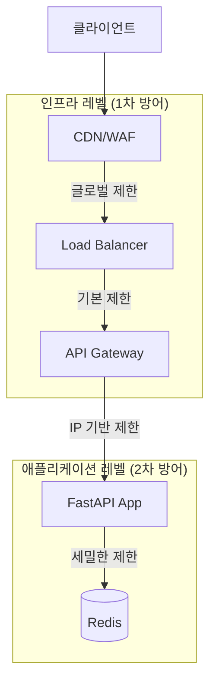

# Rate Limiting 전략 가이드

## 개요

Rate limiting을 어디에 구현할지 결정하는 것은 아키텍처 설계의 중요한 부분입니다. 이 문서는 애플리케이션 레벨과 인프라 레벨의 Rate limiting을 비교하고, 최적의 전략을 제안합니다.

---

## 1. 접근 방식 비교

### 1.1 애플리케이션 레벨 Rate Limiting

**현재 구현 방식**: FastAPI + slowapi

#### 장점 ✅

1. **세밀한 제어**
   - 엔드포인트별 다른 제한 설정 가능
   - 비즈니스 로직 기반 동적 제한 (예: 사용자 등급별)
   - 복잡한 조건부 제한 (예: 특정 사용자만 더 높은 제한)

2. **상세한 메트릭 및 로깅**
   - Prometheus 메트릭으로 상세 추적 가능
   - 어떤 엔드포인트가 차단되는지 정확히 파악
   - 비즈니스 컨텍스트와 함께 로깅 가능

3. **유연한 응답**
   - 커스텀 에러 메시지
   - Retry-After 헤더 포함
   - 사용자 친화적인 응답

4. **비즈니스 로직 통합**
   - 사용자별, API 키별 다른 제한
   - 동적 제한 조정 (예: 트래픽 패턴에 따라)

5. **개발 및 테스트 용이**
   - 로컬 환경에서 쉽게 테스트
   - 코드로 버전 관리
   - CI/CD 파이프라인에 통합 가능

#### 단점 ❌

1. **애플리케이션 부하**
   - 모든 요청이 애플리케이션까지 도달
   - Rate limit 체크를 위한 CPU/메모리 사용
   - 분산 환경에서 공유 저장소 필요 (Redis)

2. **분산 환경 복잡성**
   - 메모리 기반은 인스턴스별로 독립적 (부정확)
   - Redis 등 공유 저장소 필요
   - 네트워크 지연 추가

3. **DDoS 대응 한계**
   - 대규모 공격 시 애플리케이션까지 요청 도달
   - 애플리케이션 리소스 소모

4. **인프라 비용**
   - 애플리케이션 인스턴스 리소스 사용
   - Redis 등 추가 인프라 필요

---

### 1.2 인프라 레벨 Rate Limiting

**구현 위치**: Load Balancer, API Gateway, WAF, CDN

#### 장점 ✅

1. **조기 차단**
   - 애플리케이션에 도달하기 전에 차단
   - 애플리케이션 리소스 보호
   - DDoS 공격에 효과적

2. **고성능**
   - 하드웨어/전용 소프트웨어로 최적화
   - 낮은 지연시간
   - 높은 처리량

3. **중앙 집중식 관리**
   - 모든 서비스에 일관된 정책 적용
   - 인프라 팀이 관리
   - 애플리케이션 코드 변경 불필요

4. **비용 효율성**
   - 애플리케이션 리소스 절약
   - 전용 하드웨어 활용

5. **글로벌 분산**
   - CDN 레벨에서 지역별 제한
   - 지리적 분산 공격 대응

#### 단점 ❌

1. **제한된 유연성**
   - 엔드포인트별 세밀한 제어 어려움
   - 비즈니스 로직 기반 제한 불가
   - 동적 제한 조정 제한적

2. **메트릭 및 로깅 제한**
   - 인프라 레벨 메트릭만 제공
   - 비즈니스 컨텍스트 부족
   - 애플리케이션과 통합 어려움

3. **설정 복잡성**
   - 인프라 설정 변경 필요
   - 배포 프로세스와 분리
   - 버전 관리 어려움

4. **비용**
   - 전용 하드웨어/서비스 비용
   - 추가 인프라 관리 필요

5. **테스트 어려움**
   - 로컬 환경 재현 어려움
   - 인프라 의존성

---

## 2. 하이브리드 접근법 (권장) 🎯

**다층 방어 전략**: 인프라 레벨 + 애플리케이션 레벨

### 2.1 계층별 역할



### 2.2 계층별 제한 전략

#### Layer 1: CDN/WAF (가장 외부)
- **목적**: 대규모 DDoS 공격 차단
- **제한**: 매우 높은 임계값 (예: IP당 초당 1000회)
- **대상**: 모든 트래픽
- **도구**: Cloudflare, AWS WAF, NHN Cloud WAF

#### Layer 2: Load Balancer
- **목적**: 기본적인 Rate limiting
- **제한**: IP당 분당 1000회 (전체 API)
- **대상**: 모든 요청
- **도구**: Nginx, HAProxy, AWS ALB

#### Layer 3: API Gateway (선택적)
- **목적**: API별 기본 제한
- **제한**: API 키별, IP별
- **대상**: 특정 API 그룹
- **도구**: Kong, AWS API Gateway, NHN Cloud API Gateway

#### Layer 4: 애플리케이션 (가장 내부)
- **목적**: 세밀한 비즈니스 로직 기반 제한
- **제한**: 엔드포인트별, 사용자별, 동적 제한
- **대상**: 특정 엔드포인트
- **도구**: slowapi + Redis

---

## 3. 권장 구현 전략

### 3.1 현재 상황 분석

**현재 구현**:
- ✅ 애플리케이션 레벨: slowapi (메모리 기반)
- ⚠️ 분산 환경 대비 부족 (Redis 미사용)
- ❌ 인프라 레벨 Rate limiting 없음

### 3.2 단계별 개선 방안

#### Phase 1: 애플리케이션 레벨 개선 (즉시)

**목표**: 분산 환경 대비

```python
# Redis 기반 Rate limiting으로 전환
limiter = Limiter(
    key_func=get_client_identifier,
    default_limits=[f"{settings.rate_limit_per_minute}/minute"],
    storage_uri=f"redis://{settings.redis_host}:{settings.redis_port}",  # Redis 사용
)
```

**장점**:
- 여러 인스턴스 간 일관된 제한
- 정확한 Rate limiting
- 확장 가능

**구현 난이도**: 낮음 (설정 변경)

---

#### Phase 2: Nginx 레벨 Rate Limiting (단기)

**목표**: 기본적인 DDoS 방어

```nginx
# nginx.conf
http {
    # Rate limiting zone 정의
    limit_req_zone $binary_remote_addr zone=api_limit:10m rate=1000r/m;
    limit_req_zone $binary_remote_addr zone=share_limit:10m rate=10r/m;
    
    server {
        location /api/ {
            # 기본 API 제한
            limit_req zone=api_limit burst=20 nodelay;
            proxy_pass http://photo_api_backend;
        }
        
        location /share/ {
            # 공유 링크 엄격한 제한
            limit_req zone=share_limit burst=5 nodelay;
            proxy_pass http://photo_api_backend;
        }
    }
}
```

**장점**:
- 애플리케이션 부하 감소
- 간단한 구현
- 무료 (Nginx 사용)

**구현 난이도**: 중간

---

#### Phase 3: CDN/WAF 레벨 (중기)

**목적**: 대규모 공격 차단

**옵션**:
1. **NHN Cloud WAF**: NHN Cloud 환경에서 사용 가능
2. **Cloudflare**: 글로벌 CDN + WAF
3. **AWS WAF**: AWS 환경 사용 시

**설정 예시** (Cloudflare):
- Rate limiting 규칙: IP당 초당 100회
- DDoS 보호: 자동 활성화
- Bot 관리: 자동 차단

**장점**:
- 가장 효과적인 DDoS 방어
- 글로벌 분산
- 자동 보호

**구현 난이도**: 높음 (서비스 설정 필요)

---

## 4. 최종 권장 사항

### 4.1 현재 단계 (개발/스테이징)

**구현**:
1. ✅ **애플리케이션 레벨** (현재 구현 유지)
   - 세밀한 제어 필요
   - 메트릭 수집 중요
   - Redis로 전환 권장

2. ⚠️ **Nginx 레벨** (추가 권장)
   - 기본적인 보호
   - 구현 간단
   - 비용 없음

**이유**:
- 개발 환경에서는 세밀한 제어가 중요
- 메트릭 수집으로 문제 파악 필요
- 인프라 복잡도 최소화

---

### 4.2 프로덕션 단계

**구현**:
1. ✅ **CDN/WAF 레벨** (1차 방어)
   - 대규모 공격 차단
   - 높은 임계값 (초당 1000회)

2. ✅ **Nginx/LB 레벨** (2차 방어)
   - 기본 제한 (분당 1000회)
   - 애플리케이션 부하 감소

3. ✅ **애플리케이션 레벨** (3차 방어)
   - 엔드포인트별 세밀한 제한
   - 비즈니스 로직 기반 제한
   - Redis 사용 필수

**이유**:
- 다층 방어로 안정성 확보
- 각 계층의 장점 활용
- DDoS 공격에 효과적

---

## 5. 구현 우선순위

### 즉시 (1주일 내)
1. ✅ Redis 기반 Rate limiting으로 전환
2. ✅ Nginx 레벨 기본 Rate limiting 추가

### 단기 (1개월 내)
3. ✅ 엔드포인트별 Rate limiting 최적화
4. ✅ 모니터링 및 알림 강화

### 중기 (3개월 내)
5. ⚠️ CDN/WAF 레벨 Rate limiting 검토
6. ⚠️ API Gateway 도입 검토 (필요 시)

---

## 6. 비용 비교

### 애플리케이션 레벨만
- **비용**: Redis 인스턴스 (월 $10-50)
- **장점**: 세밀한 제어, 메트릭
- **단점**: DDoS 대응 약함

### 인프라 레벨만
- **비용**: WAF 서비스 (월 $50-200)
- **장점**: 강력한 DDoS 방어
- **단점**: 세밀한 제어 어려움

### 하이브리드 (권장)
- **비용**: Redis + Nginx (월 $10-50) + WAF (선택적, $50-200)
- **장점**: 모든 장점 결합
- **단점**: 복잡도 증가

---

## 7. 결론

### ✅ 권장 전략: **하이브리드 접근법**

1. **인프라 레벨 (Nginx/LB)**: 기본 보호, DDoS 방어
2. **애플리케이션 레벨 (Redis)**: 세밀한 제어, 비즈니스 로직

### 구현 순서

1. **즉시**: Redis 기반 Rate limiting 전환
2. **단기**: Nginx 레벨 Rate limiting 추가
3. **중기**: CDN/WAF 검토 (트래픽 증가 시)

### 핵심 원칙

- **Defense in Depth**: 다층 방어
- **Fail Open**: 인프라 실패 시 애플리케이션이 처리
- **Observability**: 모든 계층에서 메트릭 수집
- **Flexibility**: 비즈니스 요구사항에 맞는 유연한 제한

---

## 8. 참고 자료

- [Nginx Rate Limiting](https://www.nginx.com/blog/rate-limiting-nginx/)
- [Redis Rate Limiting Patterns](https://redis.io/docs/manual/patterns/rate-limiting/)
- [AWS WAF Rate Limiting](https://docs.aws.amazon.com/waf/latest/developerguide/waf-rule-statement-type-rate-based.html)
- [NHN Cloud WAF](https://guide.nhncloud.com/security/waf/)
