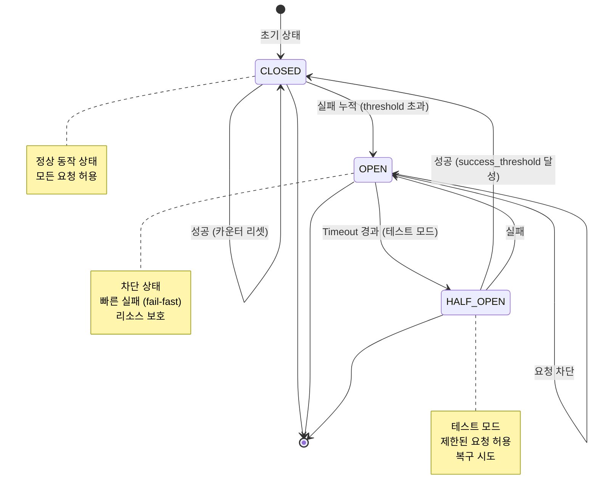
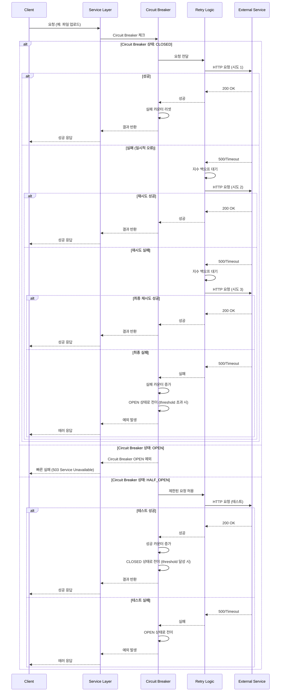
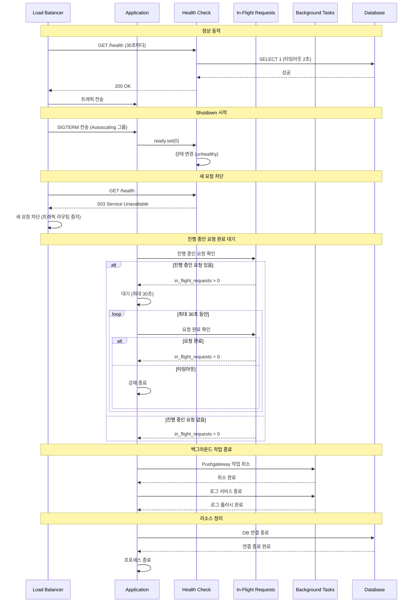
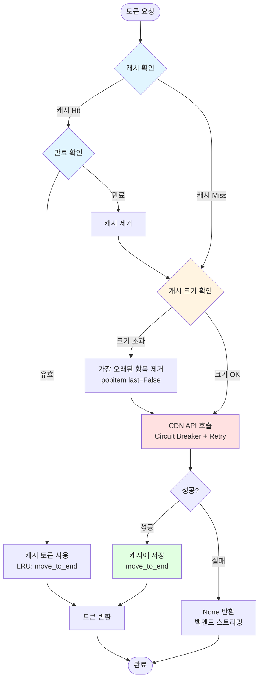
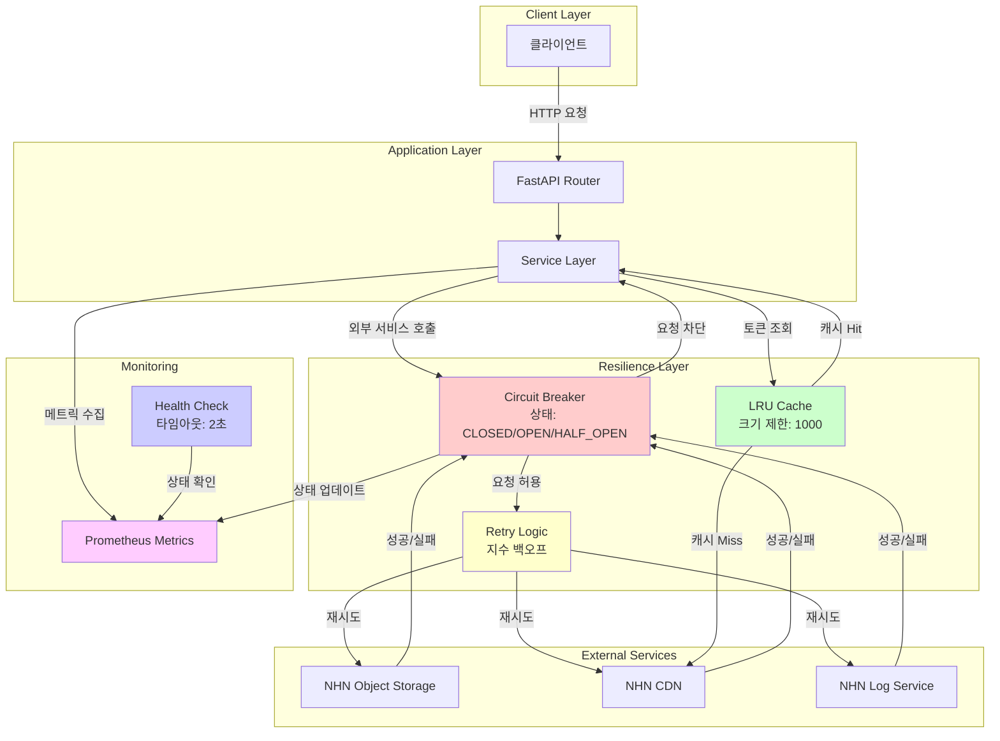
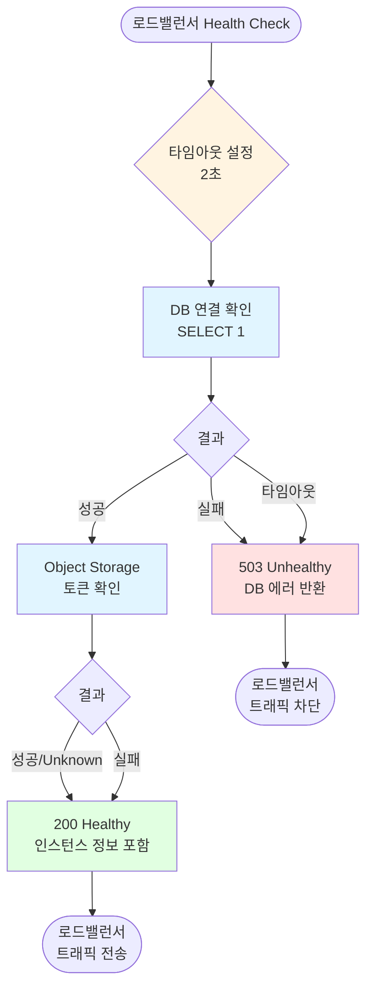
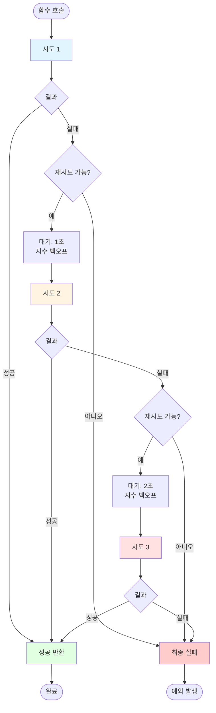
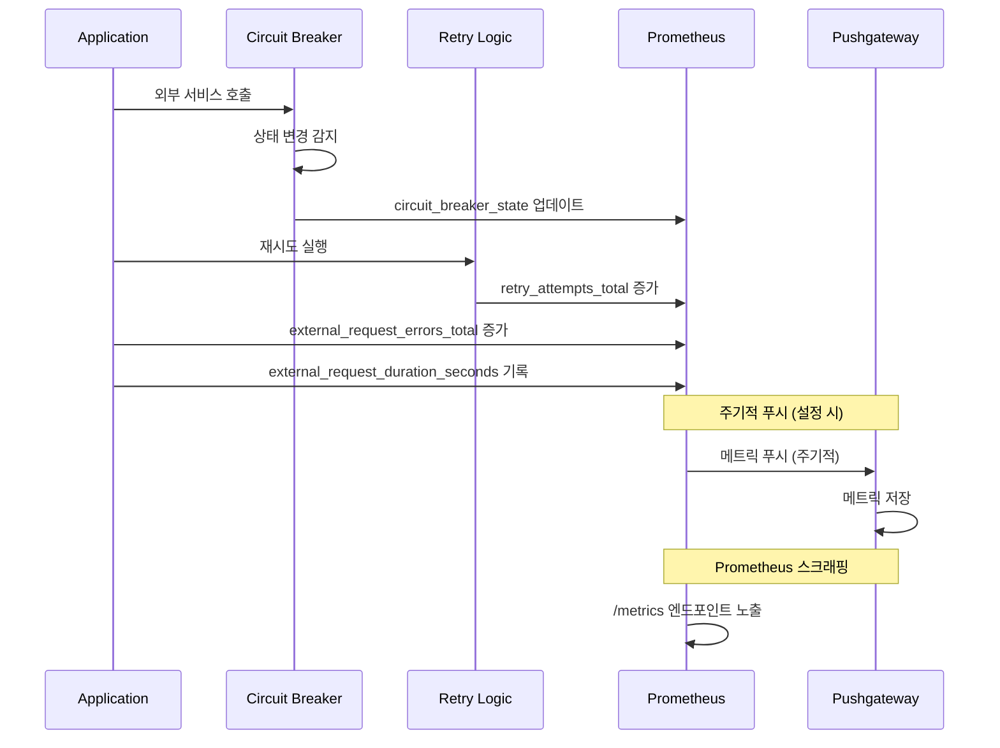

# 안정성 개선 흐름도

이 문서는 STABILITY_AUDIT.md와 SECURITY_AUDIT.md에 기반한 안정성 개선 사항의 구현 흐름을 Mermaid 다이어그램으로 설명합니다.

## 1. Circuit Breaker 상태 전이 흐름

## 2. 외부 서비스 호출 흐름 (재시도 + Circuit Breaker)

## 3. Graceful Shutdown 흐름 (Autoscaling 환경)

## 4. CDN 토큰 캐시 LRU 흐름

## 5. 전체 안정성 개선 아키텍처

## 6. Health Check 흐름 (Autoscaling 환경)

## 7. 재시도 로직 상세 흐름

## 8. 메트릭 수집 흐름

## 요약

### 구현된 개선 사항

1. **Circuit Breaker**: 외부 서비스 장애 시 빠른 실패로 리소스 보호
2. **재시도 로직**: 일시적 오류에 대한 지수 백오프 재시도
3. **CDN 캐시 LRU**: 메모리 사용량 제한 및 성능 최적화
4. **Graceful Shutdown**: Autoscaling 환경에서 안전한 종료
5. **Health Check 최적화**: 빠른 응답 시간 (2초 타임아웃)
6. **메트릭 수집**: Circuit Breaker 상태 및 재시도 추적

### 주요 흐름

- **외부 서비스 호출**: Circuit Breaker → Retry → External Service
- **Graceful Shutdown**: SIGTERM → Health Check 실패 → 요청 완료 대기 → 리소스 정리
- **캐시 관리**: LRU 알고리즘으로 메모리 사용량 제한
- **모니터링**: Prometheus 메트릭으로 실시간 상태 추적

이러한 개선 사항들을 통해 애플리케이션의 안정성과 가용성이 크게 향상되었습니다.
