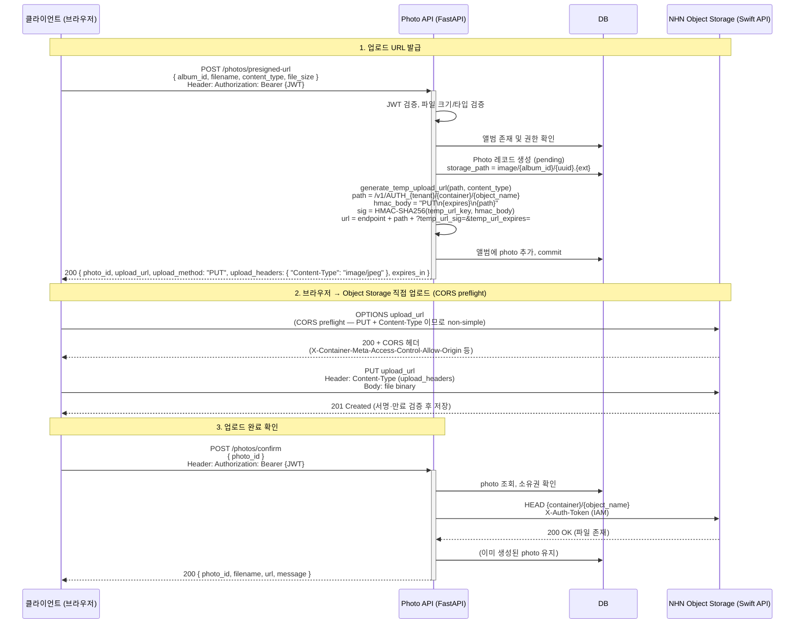
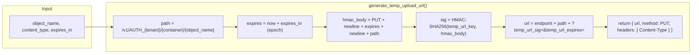

# Temp URL 업로드 흐름 (Mermaid)

## 전체 시퀀스 (클라이언트 ↔ API ↔ Object Storage)

## 서버 내부: Temp URL 생성 상세

## 단계별 요약

| 단계 | 주체 | 동작 |
|------|------|------|
| 1 | 클라이언트 | `POST /photos/presigned-url` 로 메타데이터 전달 (JWT 필수) |
| 2 | API | 검증 후 DB에 Photo(pending) 생성, Temp URL 서명 생성 후 반환 |
| 3 | 클라이언트 | Storage로 **OPTIONS** (CORS preflight) → **PUT** + `upload_headers` + 파일 바디 |
| 4 | Storage | `temp_url_sig`, `temp_url_expires` 검증 후 PUT 처리 (컨테이너 CORS 설정 필요) |
| 5 | 클라이언트 | `POST /photos/confirm` 로 완료 알림 |
| 6 | API | Storage에 파일 존재 확인(HEAD) 후 200 반환 |

## 사전 설정 (1회)

Temp URL이 동작하려면 컨테이너에 다음이 필요합니다.

1. **Temp URL Key**  
   `X-Container-Meta-Temp-URL-Key: {key}` (환경변수 `NHN_STORAGE_TEMP_URL_KEY`와 동일)
2. **CORS**  
   `X-Container-Meta-Access-Control-Allow-Origin: *` (또는 허용 오리진)  
   → 브라우저의 OPTIONS preflight가 412가 아닌 200으로 처리되려면 필수입니다.
